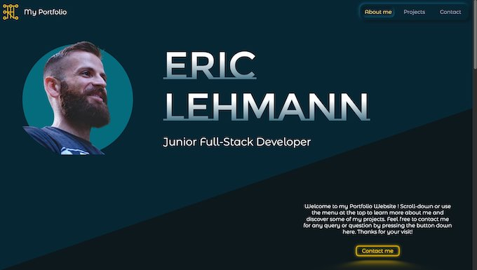
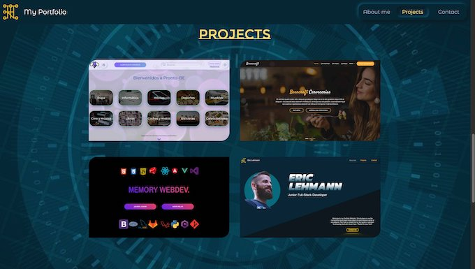
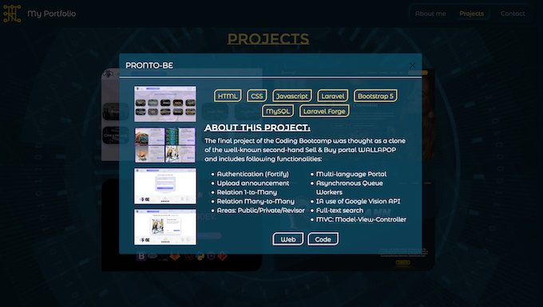
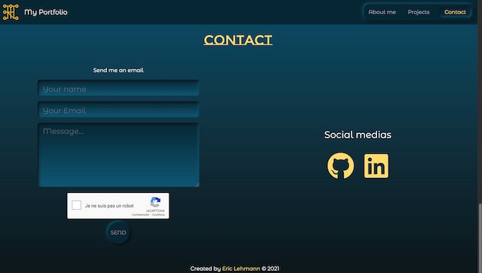

# Live Website: https://ericlehmann.site/

 

# About this Project:

 I built my Portfolio from scratch with HTML, CSS, Javascript and Bootstrap5. I tried to showcase a broad panel of the skills I have learned in terms of Responsive layout, CSS with transitions, animations, transformations, layouts with z-index, hover effects, etc...

 

Even though I used some Javascript animations from Codepens, I modified the code to adapt it and personalize it and learned from it so I could create other animations myself. I have learned a lot building this portfolio.

 

I also created the Logo/favicon myself as I wanted something personalized (the logo is my first name) but also related to technology, coding, web development.

## Tech practiced: 

   - Landing-Page Portfolio
   - CSS issues solved with JS
   - Research of Web Design
   - Creation of Logo
   - Contact Form
   - Responsive
   - Animations, Transitions, Transforms
   - Neumorphism
   - Hover effects

  
  
 
 ## Stack used:
 

 
 
 
 
 

## Snapshots:

  

   

  

   

  

   

  
